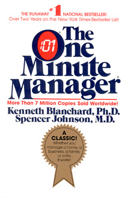

<!-- 《一分钟经理人》是由管理学家肯布兰佳和作家斯宾塞约翰逊合著的一本畅销书。这本书于1982年首次出版，迅速成为管理领域的经典之作，并在全球范围内产生了深远的影响。作者以富有启发性的故事情节和简练的管理原则为基础，向读者展示了如何在短时间内实现高效管理的方法。 -->

# **《一分钟经理人》**  
###### （美）肯·布兰佳
###### （美）斯宾塞·约翰逊

---
<!-- 在故事《一分钟经理》中，描述了一个积极进取的年轻人正在努力寻找一位高效的经理。但几经搜寻，结果始终是空的，令人失望。有一天，他听说了一位被称为“一分钟经理”的经理，他带着怀疑拜访了“一分钟经理”，终于意识到管理的真正含义来自于三个秘密：一分钟目标，一分钟称赞，与一分钟更正
-->

## 一分钟经理人的三个诀窍

- 一分钟**目标**
- 一分钟**称赞**
- 一分钟**更正**

---

<!-- 第一个诀窍，一分钟目标
如果想为一个组织做出巨大贡献，第一步就是设定明确的目标和任务。向组织的员工传达这些任务、标准和结果是领导组织朝正确方向发展的最关键要素。只要管理者和员工之间的沟通是诚实的、及时的，组织中 99% 的问题都是可以预防的。牢记80/20 原则，也就是80% 的真正重要的成功都来自于 20% 的目标，每个员工都应该预先确定他的责任，并且从一开始就知道要得到什么样的结果，并且与管理者进行对齐。每个目标都应少于 250 个字，并且可以在一分钟内完成阅读。一旦双方都充分了解了预期内容和结果应该是什么样子，就应该将其记录在不超过一页的内容上。从那时起，员工就知道对他们的期望是什么，并且很少会向经理提出问题，因为他们知道他们被雇用是为了解决组织的问题。。-->

# 第一个诀窍：一分钟目标

- **好目标**
目标本身&nbsp;&nbsp;&nbsp;&nbsp;&nbsp;&nbsp;衡量标准&nbsp;&nbsp;&nbsp;&nbsp;&nbsp;&nbsp;完成期限
- **设定目标**
运用20/80原理找到目标
明确彼此的工作预期
目标要保持一致
- **优势**
员工可以自我管理

---

<!-- 大多数管理者会等待一次年度或季度绩效考核，但此时会有太多的问题堆积起来等待解决。于是管理者可以为员工设定小的目标，以持续管理绩效并提供定期反馈。不过这并不是要对员工进行严格的管理，而是让他可以在做出正确的事情时被管理者看到。在管理者表扬员工之后，稍微停顿一下，让赞美的内容深入人心，并拍拍员工的背或伸出手来祝贺他们做得如此出色。 -->

# 第二个诀窍：一分钟称赞

1. 及时称赞下属
2. 具体地告诉对方对在哪里
3. 告诉他们这件事做对后，你狠高兴
*停顿几秒，让下属体会做对事带来的喜悦*

4. 鼓励他们继续这样做
5. 表明你对他们有信心

---

<!-- 有表扬就会有批评，正如需要花一些时间来表扬一样，批评的时间也应该差不多。这很重要，否则员工会认为他们的缺点多于优点，而这永远也不会有好结果。及时对问题和不足之处进行批评，但批评的方式需要有建设性，引导员工自我反思，找到问题的根本原因。 -->

# 第三个诀窍：一分钟更正

1. 错误发生后立即进行更正
2. 分析错误在哪里
3. 告诉他们这件事带给你的感受，以及对工作成果可能造成的影响
*沉默几秒，让员工理解和感受自己犯的错*

4. 告诉对方，他们的实际能力比表现出来的要强
5. 告诉对方，你对他们有信心

---

<!-- 保持开放的沟通渠道是一分钟经理人理念的重要组成部分。良好的沟通是管理成功的关键，一分钟经理提倡经理们与团队成员之间保持积极的沟通。这包括倾听员工的意见和建议，解决潜在问题，并在团队中建立良好的合作关系。通过保持开放的沟通渠道，经理们能够更好地了解团队的需求和期望，有针对性地进行管理，提高团队的整体绩效。 -->

#### 隐藏在背后的

# 沟通

---

<!-- 《一分钟经理人》通过生动的故事情节和简练的管理原则，为读者提供了在短时间内取得积极管理效果的实用方法。这本书不仅仅是一本适用于管理层人员的管理指南，更是一个对于任何希望提升自己管理能力的个人都具有指导意义的实用手册。通过关注关键事务、设定明确目标、及时进行赞扬和批评以及保持开放沟通渠道，经理们可以更好地应对快节奏和复杂多变的工作环境，取得更好的管理成果。 -->

<!-- paginate: false -->
<!-- footer: '' -->

**

《一分钟经理人》**

